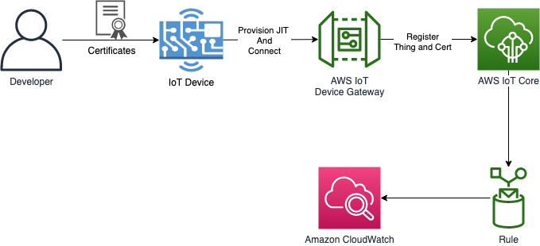
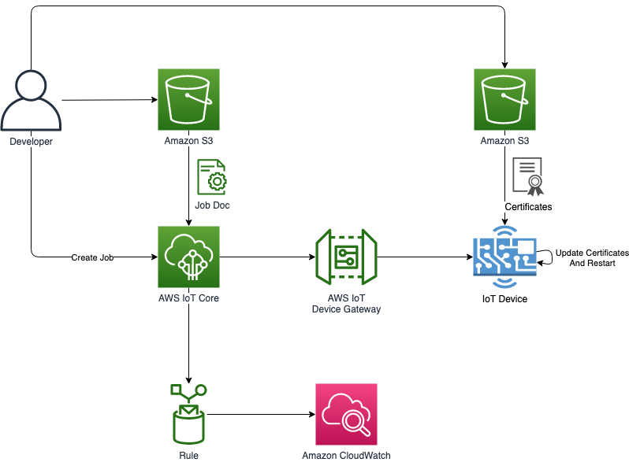

# Rotating Certification using AWS IoT Job

1. Register RooCA to AWS IoT
2. Create device certificate
3. Provision device by running job agent
4. Create rotating device certificate
5. Create job
6. Restart job agent (or restart device)

# Prerequisites

- awscli
- node.js 10.x+
- AWS Account and locally configured AWS credential

>In this example, we assume your AWS profile name is **ecs**

```bash
$ aws configure --profile ecs
AWS Access Key ID [****************4LUX]: 
AWS Secret Access Key [****************/HTe]: 
Default region name [ap-northeast-2]: 
Default output format [json]: 

$ export PROFILE=ecs
```

# Register RootCA to AWS IoT



## Create RootCA

```bash
$ ./scripts/create-rootca.sh
```

### Create private key verification certificate

```bash
$ ./scripts/create-verification-crt.sh $PROFILE
```

### Register RootCA using verification certification

create IAM Role ref https://aws.amazon.com/ko/blogs/iot/setting-up-just-in-time-provisioning-with-aws-iot-core/

```bash
$ ./scripts/create-jitp-template.sh arn:aws:iam::043490748814:role/JITPRole

$ ./scripts/register-root-ca.sh $PROFILE
```

# Create device certificate

## Creating device certificate

```bash
export THING_NAME=thing01
$ ./scripts/create-device-crt.sh $THING_NAME
```

# Provision Device to AWS IoT

## Connect to Device

install dependencies

```bash
$ cd src
$ npm i
```

## Run job agent to provision device

```bash
$ export DATA_ENDPOINT=$(aws iot describe-endpoint --endpoint-type iot:Data-ATS --profile $PROFILE | jq -r '.endpointAddress')
$ echo $DATA_ENDPOINT
xxxxxxx-ats.iot.ap-northeast-2.amazonaws.com

$ node job-agent.js -e $DATA_ENDPOINT -n $THING_NAME -c clientID1

[Job] connect
[Job] notifications initiated for thing: 596143567205b76dffc74843d37b2c7c46908ec809c1f472c24382ab6b113822
```

# Create device rotating certificate 



create device certificate to be rotated with new name

> if you use same old name for the rotating certificate, you should remove old thing from AWS IoT Console after register it.
> or status of certificate will be stuck in **STATUS.PENDINGACTIVATION**

```bash
$ ./scripts/create-new-device-crt.sh new-thing01
```

upload certificates to S3 bucket

```bash
$ export BUCKET_NAME=dongkyl-iot-test
$ ./scripts/upload-new-device-crt.sh $BUCKET_NAME $PROFILE
```

# Create job

https://docs.aws.amazon.com/iot/latest/developerguide/manage-job-cli.html

Create IAM role for generate pre-signed url for certificate file
the role should have permission to download files from Amazon S3.
```json
{
    "Version": "2012-10-17",
    "Statement": {
        "Effect": "Allow",
        "Action": "s3:GetObject",
        "Resource": [
            "arn:aws:s3:::dongkyl-iot-test/*"
        ]
    }
}
```

```bash
$ ./scripts/create-job.sh
Usage: ./scripts/create-job.sh <JOB_ID> <ROLE_ARN> <TARGET_DEVICE_ARN> <PROFILE>

$ ./scripts/create-job.sh \
  job01 \
  arn:aws:iam::929831892372:role/service-role/S3DownloadRole \
  arn:aws:iot:ap-northeast-2:929831892372:thing/thing01 \
  $PROFILE
```

when job is created, job-agent prints out result and update status of the job to completed

```bash
[Job] Rotating certificate job handler invoked, jobId: job01
[Job] Rotating certificate job document: {"operation":"rotate-crt","version":"1.0","packageName":"rotating.crt","autoStart":"true","workingDirectory":"/home/pi/tutorial","files":{"fileName":"new-device-crt.tar.gz","url":"https://dongkyl-iot-test.s3.ap-northeast-2.amazonaws.com/new-device-crt.tar.gz?X-Amz-Security-Token=IQoJb..."}}
  % Total    % Received % Xferd  Average Speed   Time    Time     Time  Current
                                 Dload  Upload   Total   Spent    Left  Speed
100  3025  100  3025    0     0  48790      0 --:--:-- --:--:-- --:--:-- 48790
undefined
download cert files successfully...
x device.key
x device.crt
x deviceAndRootCa.crt
undefined
replace cert files successfully...
```

# Restart job agent

stop job agent and restart it with new thing name

```bash
$ node src/job-agent.js -e $DATA_ENDPOINT -c clientID02 -n new-thing01
[Job] connect
[Job] notifications initiated for thing: new-thing01
```

now you can remove old *thing01* from AWS IoT
